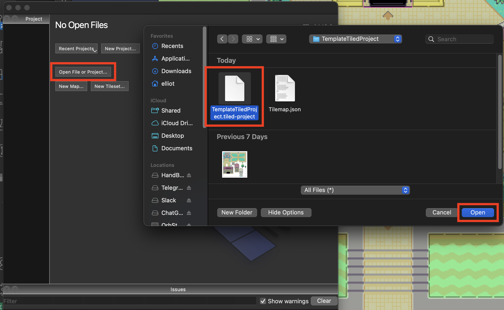
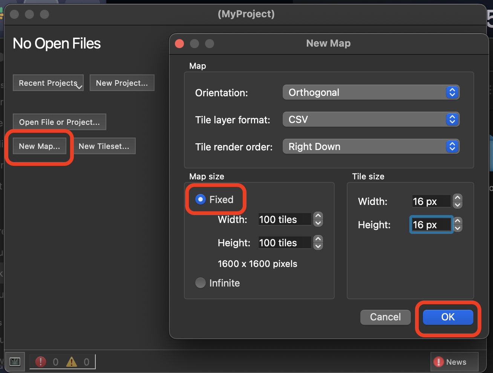
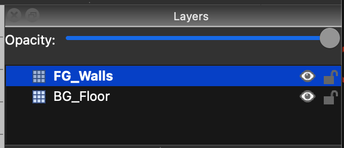

# World Guide

The goal of this guide is to get you started developing your own World on the Reality protocol. We will start by creating our own World process based on a template, and then modifying it.

For more details on the Reality protocol, please see the [Reality Docs](./Reality.md) or [Reality.lua](../process/blueprint/Reality.lua) source code.

## Creating your own World Process

### Prerequisites

- Familiarity with `ao` and `aos`. See the [ao cookbook](https://cookbook_ao.arweave.dev/welcome/index.html) for more information.

### Setup

1. Download the [`DbAdmin`](../process/blueprint/dbAdmin.lua) package source, [`World.lua`](../process/blueprint/World.lua) protocol source and the [`WorldTemplate.lua`](./src/WorldTemplate.lua) config into the same folder.
2. In that folder, launch a new aos process with a module that has sqlite3 built in, e.g.:

`aos MyWorldProcessName --module="GYrbbe0VbHim_7Hi6zrOpHQXrSQz07XNtwCnfbFo2I0"`

1. Load the `World.lua` and `WorldTemplate.lua` files in aos
```
aos> .load World.lua
Loaded Reality Protocol
aos> .load WorldTemplate.lua
Loaded World Template
```
> Optional: To enable chat in your world, download the [`Chat.lua`](../process/blueprint/Chat.lua) protocol source and load it as well: `aos> .load Chat.lua`. Most agents will need this enabled to function properly.

1. Enter your new world's process Id in [reality-viewer.arweave.net](https://reality-viewer.arweave.net/)

## Customizing your World

Edit your `WorldTemplate.lua` file to customize your world. After editing the file, you'll have to load it in `aos` again & refresh the viewer webpage for changes to take effect

For example you can move your spawn location to the opposite corner of of the Island:
```lua
WorldParameters = {
  ['2D-Tile-0'] = {
    ...
    Spawn = { 15, 12 },
    ...
  }
}
```

Or add a dumb NPC:
```lua
RealityEntitiesStatic = {
  ['MyNpc'] = {
    Type = "Avatar",
    Position = { 10, 10 },
    Metadata = {
      DisplayName = "My NPC"
    },
  }
}
```

To change the art and layout for the map itself, you'll have to update the assets. Let's get creative!

## Customizing your Tilemap

You'll need to download the [Tiled](https://www.mapeditor.org/) editor to create custom tilemaps.

### Option A: Starting from the Template Tiled Project

1. Download and extract [TemplateTiledProject.zip](./dl/TemplateTiledProject.zip) into a new folder,and open the project in Tiled.

1. Double click on "Tilemap.json" file in the Tiled editor to edit the map layout

### Option B: Starting a new Tiled Project

1. Create a new empty folder for the project
2. Create a new Tiled project at that empty folder.

3. Create a new map with a fixed size. Use the tile size of the tileset you will use later. Use tile size 16 x 16 pixels.

4. File > Save As... "Tilemap.json" with format "JSON map files"

5. Create a tileset art PNG image and copy it into your Project folder as "Primary.png". Tiles should be 16 x 16 pixels.
6. In the map editor, click "New tileset...". Name it "Primary" & choose the image from your Project folder ("Primary.png"). Make sure the tile size matches that of the map, and "Embed in map" is checked


### Editing your tilemap

1. Customize the tileset art (`Primary.png`) as desired. Tiles should be 16 x 16 pixels.
2. Prefix Background layers with "BG_" & foreground layers with "FG_"

3. Draw your map layers using the tiled editor.

4. To add collision to your map:
   - Click the "Edit Tileset" button
  
   - Select all the tiles, right click "Custom Properties", and add a property of type `bool` named `collides`
  
   - Set the `collides` property to `true` for any tiles you decide
  

### Using your tilemap with your World
1. Remember to save your map file in the Tiled editor.
2. Upload the `Primary.png` & `Tilemap.json` files to Arweave and note the TxIds.
3. Reference these TxIds in your process's WorldParameters global.
   - Update `Tileset.TxId` to `Primary.png`'s TxId
   - Update `Tilemap.TxId` to `Tilemap.json`'s TxId
